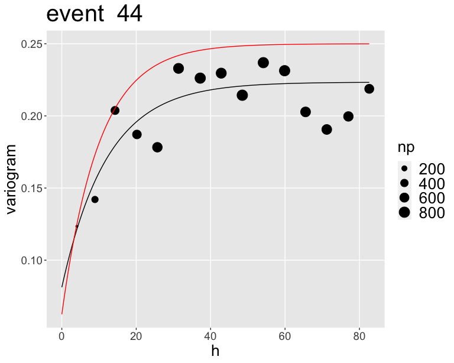
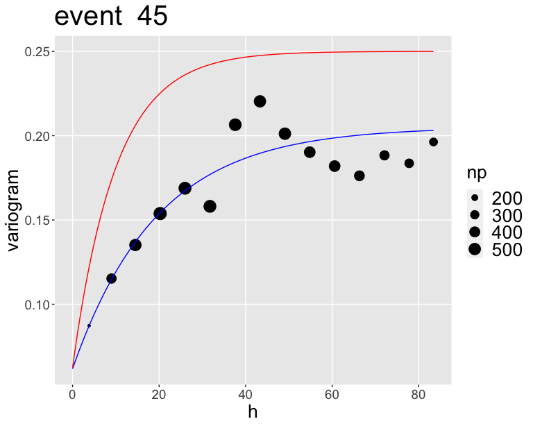
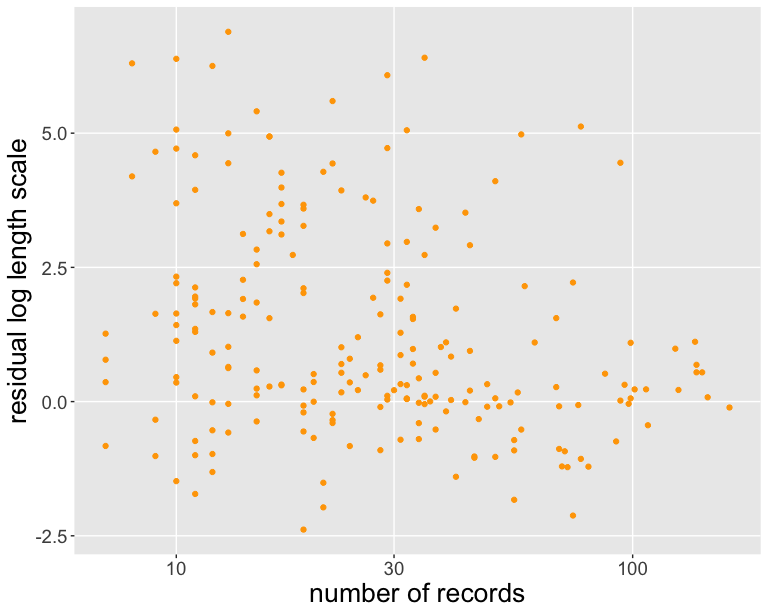
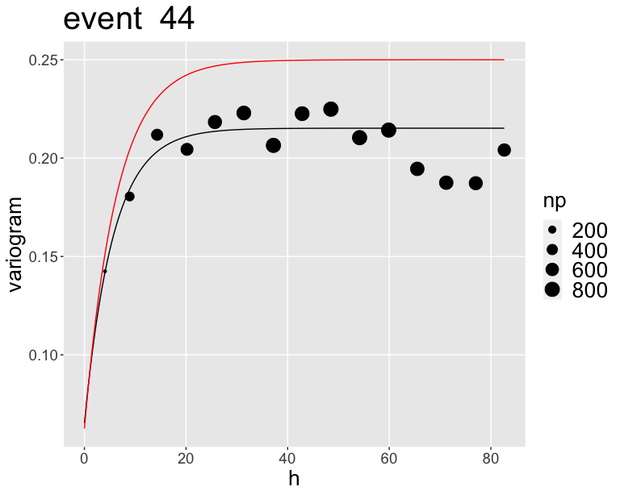

# Introduction

This is some short investigation into the effects of uncertainty on spatial correlations.
It is not comprehensive, and certainly should not be seen as authoritative, but it raises some questions (at least for me).
The results seem a bit extreme to me, but I wanted to write it up here so that I have a reference to where I can look up the code and results.

In the reviews to @Kuehn2020, where we developed spatial correlations for event terms, Peter Stafford pointed out that event terms are associated with uncertainty (which can be quite substantial for events that are not well recorded), and this should not be ignored for the spatial correlation models.
At the very least, it affects the scale parameter, as ignoring uncertainty will lead to an underestimation of $\tau$.
While looking into (non-stationary) spatial correlation models for site terms [@Kuehn2022], I noticed that the length scales I got when just using the estimated site terms were shorter than when estimating a full model (i.e. site terms and spatial correlation of site terms at the same time).
In nonergodic models based on varying coefficient models [e.g. @Landwehr2016;@Lavrentiadis2021;@Kuehn2021], we estimate spatial correlations of constants and the model at the same time, so they take uncertainty in event and site terms into account.
The question I had was what happens for spatial correlation models of within-event (and within-site) residuals.
Since event terms and site terms are uncertain, that means that the residuals when taking them out (i.e. within-event residual $\delta W$ and within-event/within-site residuals $\delta WS$) should be uncertain as well.
Typically, spatial correlations models like @Jayaram2009a are estimated for within-event residuals of well-recorded events, so the uncertainty of $\delta W$ should be small, but I'm not sure anyone has ever looked into this.
$\delta WS$ should be more uncertain, since site terms are generally more uncertain (often less recordings per site), so they might be more affected.
I think more models are moving towards partitioning into site terms, so one can probably expect spatial correlation models for $\delta WS$ to be coming out.

Here, I just simulate some data (spatially correlated observations from events/stations), and then fit models to see if I the true parameters can be estimated, using the true data generating model, as well as a partitioned model.
Model estimation is doe with Stan [@Carpenter2016], and INLA [@Rue2009] is used for partitioning the residuals.
The spatial correlation Stan model is similar to the one of @Stafford2018a; see also in @Kuehn2021c.

# Getting Started

First, we load the packages required for the analysis, ad set some things like plotting defaults, cmdstan paths and so on.


```r
# load required packages
library(cmdstanr)
library(posterior)
library(bayesplot)
library(ggplot2)
library(INLA)
library(gstat)
library(matrixStats)

theme_set(theme_gray() +
            theme(panel.grid.minor = element_blank(),
                  axis.title = element_text(size = 20),
                  axis.text = element_text(size = 14),
                  plot.title = element_text(size = 30),
                  plot.subtitle = element_text(size = 20),
                  legend.text = element_text(size = 20),
                  legend.title = element_text(size = 20)
            )
)

set_cmdstan_path('/Users/nico/GROUNDMOTION/SOFTWARE/cmdstan-2.30.1')
cmdstan_path()
```

```
## [1] "/Users/nico/GROUNDMOTION/SOFTWARE/cmdstan-2.30.1"
```

```r
cmdstan_version()
```

```
## [1] "2.30.1"
```

```r
# Path where stan models are
dir_stan <- "/Users/nico/GROUNDMOTION/PROJECTS/NONERGODIC/SCENARIO_MAPS/COREG/STAN_SPATCORR"
```


```r
LongLatToUTM<-function(x,y,zone){
  xy <- data.frame(ID = 1:length(x), X = x, Y = y)
  coordinates(xy) <- c("X", "Y")
  proj4string(xy) <- CRS("+proj=longlat +datum=WGS84")  ## for example
  res <- spTransform(xy, CRS(paste("+proj=utm +zone=",zone," ellps=WGS84",sep='')))
  return(as.data.frame(res))
}

`%notin%` <- Negate(`%in%`)
```

# Data

The simulation is done for realistic data distributions (number of events, number of stations, number of records).
Here, I use the Californian subset of NGA W2 [@Ancheta2014], used by @Abrahamson2014.
The data is read in, then coordinates are transformed to UTM coordinates, and event/station indices are set to integer values.
Finally, we make a data frame of the while data with the important variables.


```r
###### Data
data <- read.csv(file.path("data_calif_pga_t10s.csv"))

long_lat_ev <- cbind(data$Hypocenter.Longitude..deg., data$Hypocenter.Latitude..deg.)
long_lat_stat <- cbind(data$Lon_stat, data$Lat_stat)

#convert from degrees to UTM
utm_zone <- 10
co_eq_utm <- LongLatToUTM(long_lat_ev[,1],long_lat_ev[,2], utm_zone)[,c(2,3)]/1000
co_stat_utm <- LongLatToUTM(long_lat_stat[,1],long_lat_stat[,2], utm_zone)[,c(2,3)]/1000

eqid <- data$eqid
statid <- data$STATID

n_rec <- length(eqid)
n_eq <- length(unique(eqid))
n_stat <- length(unique(statid))

#SET STATION INDICES
stat  <- array(0,n_rec)
statid_uni <- unique(statid)
for (i in 1:n_stat){
  indi <- ifelse(statid %in% statid_uni[i],i,0)
  stat <- stat + indi
}

#SET EVENT INDICES
eq  <- array(0,n_rec)
eqid_uni <- unique(eqid)
for (i in 1:n_eq) {
  indi <- ifelse(eqid %in% eqid_uni[i],i,0)
  eq <- eq + indi
}

data_reg <- data.frame(eq = eq,
                       stat = stat,
                       eqid = eqid,
                       statid = statid,
                       Rrup = data$Rrup,
                       Lon_stat = data$Lon_stat,
                       Lat_stat = data$Lat_stat,
                       Lon_ev = data$Hypocenter.Longitude..deg.,
                       Lat_ev = data$Hypocenter.Latitude..deg.,
                       X_eq = co_eq_utm[,1],
                       Y_eq = co_eq_utm[,2],
                       X_stat = co_stat_utm[,1],
                       Y_stat = co_stat_utm[,2]
)
```

Only a subset is used, with a minimum number of 10 records per event, and getting rid of ``colocated'' stations (I combined stations that are very close together to have the same station id, which causes some problems).


```r
ev_list <- as.numeric(names(which(table(data_reg$eqid) > 10)))

dat_used <- data.frame()
for(i in 1:length(ev_list)) {
  tmp <- data_reg[data_reg$eqid == ev_list[i]
                  & data_reg$Rrup <= 100,]
  tmp2 <- names(which(table(tmp$statid) > 1))
  tmp <- tmp[tmp$statid %notin% tmp2,]
  dat_used <- rbind(dat_used, tmp)
}
#dat_used <- dat_used_cpo
dim(dat_used)
```

```
## [1] 7712   13
```

```r
n_rec_used <- nrow(dat_used)
n_eq_used <- length(unique(dat_used$eq))
n_stat_used <- length(unique(dat_used$stat))

#SET EVENT INDICES
eqid <- dat_used$eqid
eq  <- array(0,n_rec_used)
eqid_uni <- unique(eqid)
for (i in 1:n_eq_used) {
  indi <- ifelse(eqid %in% eqid_uni[i],i,0)
  eq <- eq + indi
}
dat_used$eq <- eq

#SET STATION INDICES
statid <- dat_used$statid
stat  <- array(0,n_rec_used)
statid_uni <- unique(statid)
for (i in 1:n_stat_used) {
  indi <- ifelse(statid %in% statid_uni[i],i,0)
  stat <- stat + indi
}
dat_used$stat <- stat


#### find indices of events, need to be sorted by event ids 
start <- vector(length = n_eq_used)
end <- vector(length = n_eq_used)
num_eq <- vector(length = n_eq_used)
for(i in 1:n_eq_used) {
  start[i] <- min(which(eq == i))
  end[i] <- max(which(eq == i))
  num_eq[i] <- end[i] - start[i] + 1
}
max_num <- max(num_eq)

ind_na_eq <- array(0, dim = c(n_eq_used, max_num))
len_na_eq <- vector(mode = "numeric", length = n_eq_used)
for(i in 1:n_eq_used) {
  #tmp <- which(!is.na(y_target[eq == i])) can be used to flter out NA
  tmp <- which(eq == i)
  ind_na_eq[i, 1:length(tmp)] <- tmp
  len_na_eq[i] <- length(tmp)
}
```


# Simulation of within-event/within-station data with different length scales


Here, some data is generated according to the following model
$$
\delta B \sim N(0, \tau) \\
\delta S \sim N(0, \phi_{S2S}) \\
\ell \sim LN(\mu_{\ln \ell}, \sigma_{\ln \ell}) \\
Y \sim GP(\delta B + \delta S, k(\vec{x}_s,\vec{x}_s')) \\
k(\vec{x}_s,\vec{x}_s')) = \delta_{ij,eq} \left(\theta_1^2 \exp \left[- \frac{|\vec{x}_s - \vec{x}_s')|}{\ell}\right] + \theta_2^2 \delta_{ij,rec}\right)
$$
So basically, sample some event terms and stations terms from normal distributions, and then sample observations from a GP with mean event term plus station term, and exponential covariance function with some observation noise.
The covariance matrix is zero if records are not from the same event ($\delta_{ij,eq}$ is supposed to be a Kronecker symbol for events, and similarly $\delta_{rec}$ for records; not the best notation, but should work).
We also use different length scales for the events, which are distributed according to a lognormal distribution.
We have $\phi_{SS}^2 = \theta_1^2 + \theta_2^2$, which is modeled as $\theta_1^2 = \omega \phi_{SS}^2$ and $\theta_2^2 = (1 - \omega) \phi_{SS}^2$, and $\omega$ is between 0 and 1.

The reason to have different length scales for each event has less to do with the simulation, and more to do with the fact that I wanted to see whether it is possible to estimate the different length scales and associated hyperparameters.
This offers the possibility to do hat on real data, and possibly look into spatial correlations of length scales (but I am getting ahead of myself).

Below we define the hyperparameters for simulation.


```r
sim_name <- "sim-l"

phi_ss_sim <- 0.5
tau_sim <- 0.4
phi_s2s_sim <- 0.4
mu_log_ell <- 2.3 # approx log(10)
sigma_log_ell <- 0.5

n_wp <- 500
n_sample <- 200

data_list_sim <- list(N = n_rec_used,
                      NEQ = n_eq_used,
                      NSTAT = n_stat_used,
                      M = max_num,
                      eq = dat_used$eq,
                      stat = dat_used$stat,
                      X = cbind(dat_used$X_stat, dat_used$Y_stat),
                      sigma_rec = phi_ss_sim,
                      sigma_eq = tau_sim,
                      sigma_stat = phi_s2s_sim,
                      omega = 0.75,
                      mu_log_ell = mu_log_ell,
                      sigma_log_ell = sigma_log_ell,
                      ind_eq = ind_na_eq,
                      len_eq = len_na_eq
)
```

## Simulation with Stan

Synthetic data are simulated with Stan.


```r
model <- 'gmm_sim_spatcorr_l'
file <- file.path(dir_stan, sprintf("%s.stan", model))
mod <- cmdstan_model(file, include_paths = c(file.path(dir_stan, 'stan_include')), force_recompile = TRUE)
mod$print()
```

```
## /*
##  * Model to simulate total residuals
##  */
## 
## #include functions.stan
## 
## data {
##   int N;
##   int NEQ;
##   int NSTAT;
##   int M;
##   
##   array[N] int<lower=1,upper=NEQ> eq;
##   array[N] int<lower=1,upper=NSTAT> stat;
## 
##   array[N] vector[2] X;
## 
##   array[NEQ, M] int ind_eq;
##   array[NEQ] int len_eq;
## 
##   real<lower=0> sigma_rec;
##   real<lower=0> sigma_eq;
##   real<lower=0> sigma_stat;
##   real mu_log_ell;
##   real<lower=0> sigma_log_ell;
##   real<lower=0,upper=1> omega; // variance weights for ph_SS
## }
## 
## transformed data {
##   real theta = sqrt(omega .* square(sigma_rec));
##   real theta2 = sqrt((1 - omega) .* square(sigma_rec));
## }
## 
## parameters {
## 
## }
## 
## model {
## }
## 
## generated quantities {
##   array[NEQ] real eqterm = normal_rng(rep_vector(0, NEQ), sigma_eq);
##   array[NEQ] real ell = exp(normal_rng(rep_vector(mu_log_ell, NEQ), sigma_log_ell));
##   array[NSTAT] real statterm = normal_rng(rep_vector(0, NSTAT), sigma_stat);;
##   vector[N] Y_sim;
## 
##   {
##     vector[N] mu = to_vector(eqterm)[eq] + to_vector(statterm)[stat];
## 
##     for(i in 1:NEQ) {
##       matrix[len_eq[i], len_eq[i]] L;
##       L = calc_L2_M1(X[ind_eq[i, 1:len_eq[i]]], len_eq[i], theta, ell[i], theta2);
## 
##       Y_sim[ind_eq[i, 1:len_eq[i]]] = multi_normal_cholesky_rng(mu[ind_eq[i, 1:len_eq[i]]], L);
##     }
## 
##   }
## }
```


```r
fit_sim <- mod$sample(
  data = data_list_sim,
  seed = 5618,
  chains = 1,
  iter_sampling = 1,
  iter_warmup = 0,
  fixed_param = TRUE
)
```

```
## Running MCMC with 1 chain...
## 
## Chain 1 Iteration: 1 / 1 [100%]  (Sampling) 
## Chain 1 finished in 0.1 seconds.
```

```r
draws_sim <- fit_sim$draws()
y_sim <- as.vector(subset(draws_sim, variable=c('Y_sim'), regex=TRUE))
deltaB_sim <- as.vector(subset(draws_sim, variable=c('eqterm'), regex=TRUE))
deltaS_sim <- as.vector(subset(draws_sim, variable=c('statterm'), regex=TRUE))
ell_sim <- as.vector(subset(draws_sim, variable=c('ell'), regex=TRUE))
```

## Estimation with Stan -- full model

Now, the model parameters are estimated, using the full model, i.e. event terms, station terms, all hyperparameters, length scales.
The Stan code is simple, just moving parameter declarations to the `parameters` block, the sampling statements to the `model` block, and adding some priors.
I ran the model in a different session, so I'm just reading in the results now (it takes quite long to run).


```r
data_list_sim$Y <- y_sim

model <- 'gmm_partition_spatcorr_l'
file <- file.path(dir_stan, sprintf("%s.stan", model))
mod <- cmdstan_model(file, include_paths = c(file.path(dir_stan, 'stan_include')))

# fit_l <- mod$sample(
#   data = data_list_sim,
#   seed = 5618,
#   chains = 4,
#   iter_sampling = n_sample,
#   iter_warmup = n_wp,
#   refresh = 10,
#   max_treedepth = 10,
#   adapt_delta = 0.8,
#   parallel_chains = 2
# )
# fit_l$cmdstan_diagnose()
# fit_l$save_object(file = file.path(dir_stan, sprintf("fit_%s_%s.RDS", sim_name, model)))
fit_l <- readRDS(file.path(dir_stan, sprintf("fit_%s_%s.RDS", sim_name, model)))
fit_l$time()
```

```
## $total
## [1] 9999.454
## 
## $chains
##   chain_id  warmup sampling   total
## 1        1 3284.50  1559.03 4843.53
## 2        2 3165.42  1547.90 4713.33
## 3        3 3149.80  1936.78 5086.57
## 4        4 3389.73  1759.37 5149.10
```

Results look pretty good.
Hyperparameters are pretty well estimated.


```r
draws_l <- fit_l$draws()
summarise_draws(subset(draws_l, variable=c('omega', 'sigma', 'mu_log_ell', 'theta'), regex=TRUE))
```

```
## # A tibble: 8 × 10
##   variable       mean median      sd     mad    q5   q95  rhat ess_bulk ess_tail
##   <chr>         <dbl>  <dbl>   <dbl>   <dbl> <dbl> <dbl> <dbl>    <dbl>    <dbl>
## 1 omega         0.750  0.749 0.0353  0.0362  0.692 0.808  1.00     593.    1127.
## 2 sigma_rec     0.500  0.500 0.00523 0.00518 0.491 0.509  1.00    1448.    1496.
## 3 sigma_eq      0.411  0.410 0.0223  0.0220  0.375 0.449  1.00    3262.    1642.
## 4 sigma_stat    0.386  0.386 0.0113  0.0111  0.367 0.404  1.00    1393.    1284.
## 5 sigma_log_ell 0.516  0.514 0.0863  0.0859  0.379 0.662  1.03     122.     223.
## 6 mu_log_ell    2.15   2.15  0.104   0.109   1.98  2.32   1.00     441.     900.
## 7 theta         0.433  0.433 0.0114  0.0115  0.414 0.451  1.00     861.    1363.
## 8 theta2        0.250  0.250 0.0179  0.0181  0.219 0.278  1.00     549.    1137.
```

## Partition Residuals with INLA

Now, I partition the data into event, station terms and residuals $\delta WS$, using INLA (I also tried `lmer`, and results are pretty much the same).
Then, one can run a spatial correlation model on just the residuals.
The standard deviations match quite well the theoretical values.


```r
dat_used$Y_sim <- y_sim

# priors
prior_prec_tau_lg    <- list(prec = list(prior = "loggamma", param = c(2, 0.5)))
prior_prec_phiS2S_lg <- list(prec = list(prior = "loggamma", param = c(2, 0.5)))
prior_prec_phiSS_lg  <- list(prec = list(prior = "loggamma", param = c(2, 0.5)))
prior.fixed <- list(mean.intercept = 0, prec.intercept = 5)

###### partition into evet terms/station terme
fit_inla_sim <- inla(Y_sim ~ 1 + f(eq, model = "iid", hyper = prior_prec_tau_lg)
                     + f(stat, model = "iid",hyper = prior_prec_phiS2S_lg), 
                     data = dat_used,
                     family="gaussian",
                     control.fixed = prior.fixed,
                     control.family = list(hyper = list(prec = prior_prec_phiSS_lg)),
                     control.compute = list(dic = TRUE, waic = TRUE)
)
print(1/sqrt(fit_inla_sim$summary.hyperpar$mean))
```

```
## [1] 0.4894089 0.4330651 0.3836540
```

```r
dat_used$deltaWS_sim <- y_sim - fit_inla_sim$summary.fitted.values$mean
print(c(mean(dat_used$deltaWS_sim), sd(dat_used$deltaWS_sim)))
```

```
## [1] 6.415224e-06 4.567130e-01
```

Below is a histogram of the standard deviations of the fitted values.
Since the residuals are just the observations (constant values) minus the fitted values, this should also be the standard deviations of the within-event/within-station residuals.
Most are between 0.1 and 0.15, which is not small for ground-motion data.


```r
df_plot <- data.frame(sd_dws = fit_inla_sim$summary.fitted.values$sd)

ggplot(df_plot) +
  geom_histogram(mapping = aes(sd_dws))
```

```
## `stat_bin()` using `bins = 30`. Pick better value with `binwidth`.
```


## Estimation with Stan on $\delta WS$

Now, the spatial correlation models are estimated (using Stan) with the within-event/within-station residuals as target variable.
The Stan code is similar to before, just getting rid of the event/station terms and associated parameters.


```r
data_list_sim$Y <- dat_used$deltaWS_sim

model <- 'gmm_spatcorr_l'
file <- file.path(dir_stan, sprintf("%s.stan", model))
mod <- cmdstan_model(file, include_paths = c(file.path(dir_stan, 'stan_include')))

# fit_dws_l <- mod$sample(
#   data = data_list_sim,
#   seed = 5618,
#   chains = 4,
#   iter_sampling = n_sample,
#   iter_warmup = n_wp,
#   refresh = 10,
#   max_treedepth = 10,
#   adapt_delta = 0.8,
#   parallel_chains = 2
# )
# fit_dws_l$cmdstan_diagnose()
# fit_dws_l$save_object(file = file.path(dir_stan, sprintf("fit_%s_%s.RDS", sim_name, model)))
fit_dws_l <- readRDS(file.path(dir_stan, sprintf("fit_%s_%s.RDS", sim_name, model)))
fit_dws_l$time()
```

```
## $total
## [1] 11398.85
## 
## $chains
##   chain_id  warmup sampling   total
## 1        1 5704.32  789.054 6493.38
## 2        2 5760.54  936.481 6697.02
## 3        3 4004.10  332.726 4336.82
## 4        4 4322.43  373.656 4696.08
```

Results are not as good as before.
In particular, the length scale is underestimated.


```r
draws_dws_l <- fit_dws_l$draws()
summarise_draws(subset(draws_dws_l, variable=c('omega', 'sigma', 'mu_log_ell', 'theta'), regex=TRUE))
```

```
## # A tibble: 6 × 10
##   variable       mean median      sd     mad    q5   q95  rhat ess_bulk ess_tail
##   <chr>         <dbl>  <dbl>   <dbl>   <dbl> <dbl> <dbl> <dbl>    <dbl>    <dbl>
## 1 omega         0.465  0.465 0.0452  0.0461  0.391 0.540  1.01    235.     502. 
## 2 sigma_rec     0.631  0.630 0.00539 0.00533 0.622 0.639  1.02   1197.     551. 
## 3 sigma_log_ell 0.519  0.515 0.115   0.121   0.329 0.722  1.15     20.7     33.7
## 4 mu_log_ell    1.69   1.70  0.130   0.127   1.45  1.87   1.05     69.6    194. 
## 5 theta         0.429  0.429 0.0219  0.0216  0.393 0.465  1.01    245.     533. 
## 6 theta2        0.461  0.462 0.0193  0.0189  0.427 0.491  1.01    248.     473.
```

## Estimation with Variograms

Now, estimation is done with traditional geostatistics using a variogram.
Variograms are calculated and fitted with package `gstat`.
For each event, a variogram is calculated, and the exponential model is fitted.
I'm just using the default settings of `variogram`, which gives some warnings during fitting for multiple events (in particular for small number of records).


```r
res_variogram <- matrix(nrow = n_eq_used, ncol = 5)
i <- 1
for(i in 1:n_eq_used) {
  dat_eq <- dat_used[dat_used$eq == i,]
  coordinates(dat_eq) = ~X_stat + Y_stat
  
  v_lin <- variogram(deltaWS_sim ~ 1, dat_eq)
  fit_v_lin <- fit.variogram(v_lin, model = vgm("Exp"))
  res_variogram[i,] <- c(i, fit_v_lin$psill, fit_v_lin$range)
}
```

Below are histograms of the estimated (logarithmic) length-scales and nugget values.


```r
p <- ggplot(as.data.frame(res_variogram)) +
  geom_histogram(mapping = aes(V5)) +
  scale_x_log10() +
  labs(x="estimated length scales", y="#")
print(p)
```

```
## `stat_bin()` using `bins = 30`. Pick better value with `binwidth`.
```

```r
p <- ggplot(as.data.frame(res_variogram)) +
  geom_histogram(mapping = aes(V2)) +
  scale_x_log10() +
  labs(x="estimated nugget values", y="#")
print(p)
```

```
## Warning: Transformation introduced infinite values in continuous x-axis
```

```
## `stat_bin()` using `bins = 30`. Pick better value with `binwidth`.
```

```
## Warning: Removed 97 rows containing non-finite values (stat_bin).
```


Now some plots of variograms of well recorded events (number of records more than 80).


```r
omega_sim <- 0.75
theta1_sim_sq <- omega_sim * phi_ss_sim^2
theta2_sim_sq <- (1-omega_sim) * phi_ss_sim^2

eq80  <- as.numeric(names(which(table(dat_used$eq) > 80)))
for(i in eq80) {
  dat_eq <- dat_used[dat_used$eq == i,]
  coordinates(dat_eq) = ~X_stat + Y_stat
  v_lin <- variogram(deltaWS_sim ~ 1, dat_eq)
  fit_v_lin <- fit.variogram(v_lin, model = vgm("Exp"))
  preds <- variogramLine(fit_v_lin, maxdist = max(v_lin$dist))
  preds$gamma_sim <- theta2_sim_sq + theta1_sim_sq * (1 - exp(-preds[,1] / ell_sim[i]))
  
  if(abs(log(ell_sim[i]) - log(fit_v_lin$range[2])) < 0.5) {
    col = 'black'
  } else {
    col = 'blue'
  }
  
  p <- ggplot() + 
    geom_point(data = v_lin, aes(x = dist, y = gamma, size = np)) +
    geom_line(data = preds, aes(x = dist, y = gamma), color = col) +
    geom_line(data = preds, aes(x = dist, y = gamma_sim), color = 'red') +
    labs(title = paste('event ',i), x = 'h' , y = 'variogram')
  print(p)
}
```

```
## Warning in fit.variogram(v_lin, model = vgm("Exp")): No convergence after 200
## iterations: try different initial values?
```


## Some plots of results

Here are some plots.
Nothing fancy, just plotting estimated values against true values.
I should probably add error bars, but this does it for now.


```r
tmp <- as_draws_matrix(subset(draws_l, variable=c('^log_ell'), regex=TRUE))
tmp2 <- as_draws_matrix(subset(draws_dws_l, variable=c('^log_ell'), regex=TRUE))
df_plot <- data.frame(ell_sim = ell_sim,
                      ell_est = exp(colMeans(tmp))[1:n_eq_used],
                      ell_est_dws = exp(colMeans(tmp2))[1:n_eq_used],
                      ell_vario = res_variogram[,5],
                      n_eq = as.numeric(table(eq)),
                      dell_est = colMeans(tmp)[1:n_eq_used] - log(ell_sim),
                      dell_est_dws = colMeans(tmp2)[1:n_eq_used] - log(ell_sim),
                      dell_vario = log(res_variogram[,5]) - log(ell_sim),
                      log_ell_est_sd = colSds(tmp)[1:n_eq_used]
                      )

p <- ggplot() + 
  geom_point(data = df_plot, aes(x = ell_sim, y = ell_est)) +
  geom_point(data = df_plot, aes(x = ell_sim, y = ell_est_dws), color = 'red') +
  geom_point(data = df_plot, aes(x = ell_sim, y = ell_vario), color = 'orange') +
  scale_y_log10() + scale_x_log10() +
  labs(x="true length scale", y="estimated length scale")
print(p)

p <- ggplot() + 
  geom_point(data = df_plot, aes(x = n_eq, y = dell_est)) +
  geom_point(data = df_plot, aes(x = n_eq, y = dell_est_dws), color = 'red') +
  geom_point(data = df_plot, aes(x = n_eq, y = dell_vario), color = 'orange') +
  geom_errorbar(data = df_plot, aes(x = n_eq, ymin = dell_est - log_ell_est_sd,
                                    ymax = dell_est + log_ell_est_sd)) +
  scale_x_log10() +
  labs(x="number of records", y="residual log length scale")
print(p)

p <- ggplot() + 
  geom_point(data = df_plot, aes(x = n_eq, y = log_ell_est_sd)) +
  scale_x_log10() +
  labs(x="number of records", y="sd of length scale")
print(p)
```


The length scales are quite well estimated  with the correct model, but are underestimated (with Stan) when using just the residuals.
The variogram values are all over the place, but are ok for well-recorded events ($N_{rec} > 80$).
One can probably get some sort of visual quality assurance from the variograms.
I'm not too familiar with variogram estimation, and I guess it's nice to get some warnings, but it seems there are a lot of little tweaks one can do, and a bad fit might be hard to detect.
On the other hand, similar things apply to the GP estimation, as the model based on the within-event residuals converges well, but gives biased length scales.
I'm a bit surprised that the variograms give reasonable estimates of the length scales (at least for well-recorded events), even though the uncertainty in the target variable ($\delta WS$) is ignored.
For the GP estimation, the hierarchical nature (the event-specific length scales are basically random effects) means that the length scales are somewhat constrained.
Not sure if one can do that as well with the variograms -- I guess one could calculate variograms, and then fit the same model with some random effects structure to it.

# Simulation of within-event/within-station data with same length scale

Here, some data is generated according to the following model (same as before, but same length scales for events)
$$
\delta B \sim N(0, \tau) \\
\delta S \sim N(0, \phi_{S2S}) \\
Y \sim GP(\delta B + \delta S, k(\vec{x}_s,\vec{x}_s')) \\
k(\vec{x}_s,\vec{x}_s')) = \delta_{ij,eq} \left(\theta_1^2 \exp \left[- \frac{|\vec{x}_s - \vec{x}_s')|}{\ell}\right] + \theta_2^2 \delta_{ij,rec}\right)
$$
Same model as before, but he length scale is the same for each event.
Below are the hyperparameters (length scale of 10km).

```r
sim_name <- "sim"

phi_ss_sim <- 0.5
tau_sim <- 0.4
phi_s2s_sim <- 0.4

n_wp <- 500
n_sample <- 200

data_list_sim <- list(N = n_rec_used,
                      NEQ = n_eq_used,
                      NSTAT = n_stat_used,
                      M = max_num,
                      eq = dat_used$eq,
                      stat = dat_used$stat,
                      X = cbind(dat_used$X_stat, dat_used$Y_stat),
                      sigma_rec = phi_ss_sim,
                      sigma_eq = tau_sim,
                      sigma_stat = phi_s2s_sim,
                      omega = 0.75,
                      ell = 10,
                      ind_eq = ind_na_eq,
                      len_eq = len_na_eq
)
```

## Simulation with Stan

Synthetic data are simulated with Stan.


```r
model <- 'gmm_sim_spatcorr'
file <- file.path(dir_stan, sprintf("%s.stan", model))
mod <- cmdstan_model(file, include_paths = c(file.path(dir_stan, 'stan_include')), force_recompile = TRUE)
mod$print()
```

```
## /*
##  * Model to simulate total residuals
##  */
## 
## #include functions.stan
## 
## data {
##   int N;
##   int NEQ;
##   int NSTAT;
##   int M;
##   
##   array[N] int<lower=1,upper=NEQ> eq;
##   array[N] int<lower=1,upper=NSTAT> stat;
## 
##   array[N] vector[2] X;
## 
##   array[NEQ, M] int ind_eq;
##   array[NEQ] int len_eq;
## 
##   real<lower=0> sigma_rec;
##   real<lower=0> sigma_eq;
##   real<lower=0> sigma_stat;
##   real<lower=0> ell; // length scales
##   real<lower=0,upper=1> omega; // variance weights for ph_SS
## }
## 
## transformed data {
##   real theta = sqrt(omega .* square(sigma_rec));
##   real theta2 = sqrt((1 - omega) .* square(sigma_rec));
## }
## 
## parameters {
## 
## }
## 
## model {
## }
## 
## generated quantities {
##   array[NEQ] real eqterm = normal_rng(rep_vector(0, NEQ), sigma_eq);
##   array[NSTAT] real statterm = normal_rng(rep_vector(0, NSTAT), sigma_stat);;
##   vector[N] Y_sim;
## 
##   {
##     vector[N] mu = to_vector(eqterm)[eq] + to_vector(statterm)[stat];
## 
##     for(i in 1:NEQ) {
##       matrix[len_eq[i], len_eq[i]] L;
##       L = calc_L2_M1(X[ind_eq[i, 1:len_eq[i]]], len_eq[i], theta, ell, theta2);
## 
##       Y_sim[ind_eq[i, 1:len_eq[i]]] = multi_normal_cholesky_rng(mu[ind_eq[i, 1:len_eq[i]]], L);
##   }
## 
##   }
## }
```


```r
fit_sim <- mod$sample(
  data = data_list_sim,
  seed = 5618,
  chains = 1,
  iter_sampling = 1,
  iter_warmup = 0,
  fixed_param = TRUE
)
```

```
## Running MCMC with 1 chain...
## 
## Chain 1 Iteration: 1 / 1 [100%]  (Sampling) 
## Chain 1 finished in 0.0 seconds.
```

```r
draws_sim <- fit_sim$draws()
y_sim <- as.vector(subset(draws_sim, variable=c('Y_sim'), regex=TRUE))
deltaB_sim <- as.vector(subset(draws_sim, variable=c('eqterm'), regex=TRUE))
deltaS_sim <- as.vector(subset(draws_sim, variable=c('statterm'), regex=TRUE))
```


## Estimation with Stan -- full model

Now, the model parameters are estimated, using the full model, i.e. event terms, station terms, all hyperparameters, length scales.
The Stan code is simple, just moving parameter declarations to th `parameters` block, the sampling statements to the `model` block, and adding some priors.
I ran the model in a different session, so I'm just reading in the results now (it takes quite long to run).


```r
data_list_sim$Y <- y_sim

model <- 'gmm_partition_spatcorr'
file <- file.path(dir_stan, sprintf("%s.stan", model))
mod <- cmdstan_model(file, include_paths = c(file.path(dir_stan, 'stan_include')))

# fit_l <- mod$sample(
#   data = data_list_sim,
#   seed = 5618,
#   chains = 4,
#   iter_sampling = n_sample,
#   iter_warmup = n_wp,
#   refresh = 10,
#   max_treedepth = 10,
#   adapt_delta = 0.8,
#   parallel_chains = 2
# )
# fit_l$cmdstan_diagnose()
# fit_l$save_object(file = file.path(dir_stan, sprintf("fit_%s_%s.RDS", sim_name, model)))
fit_l <- readRDS(file.path(dir_stan, sprintf("fit_%s_%s.RDS", sim_name, model)))
fit_l$time()
```

```
## $total
## [1] 7054.487
## 
## $chains
##   chain_id  warmup sampling   total
## 1        1 2677.73  510.926 3188.66
## 2        2 2637.70  513.020 3150.72
## 3        3 3358.46  540.556 3899.02
## 4        4 3019.68  453.479 3473.16
```

Results look pretty good.
Hyperparameters are pretty well estimated.


```r
draws_l <- fit_l$draws()
summarise_draws(subset(draws_l, variable=c('omega', 'sigma', 'ell','theta'), regex=TRUE))
```

```
## # A tibble: 7 × 10
##   variable    mean median      sd     mad    q5    q95  rhat ess_bulk ess_tail
##   <chr>      <dbl>  <dbl>   <dbl>   <dbl> <dbl>  <dbl> <dbl>    <dbl>    <dbl>
## 1 omega      0.766  0.766 0.0281  0.0280  0.719  0.813 1.00      686.     552.
## 2 sigma_rec  0.503  0.503 0.00526 0.00483 0.494  0.512 1.01      643.     712.
## 3 sigma_eq   0.411  0.409 0.0227  0.0230  0.374  0.449 1.01     1424.     676.
## 4 sigma_stat 0.391  0.392 0.0113  0.0114  0.373  0.410 0.998     708.     626.
## 5 ell        9.72   9.69  0.635   0.661   8.80  10.9   1.00      697.     770.
## 6 theta      0.440  0.440 0.00991 0.00950 0.424  0.456 1.01      833.     575.
## 7 theta2     0.243  0.243 0.0146  0.0139  0.219  0.266 1.00      626.     579.
```

## Estimation with Stan -- full model with different length scales (non-hierarchical)

Now, the model parameters are estimated, using the full model, i.e. event terms, station terms, all hyperparameters, length scales.
Different length scales per event are estimated, but not as random effects.


```r
data_list_sim$Y <- y_sim

model <- 'gmm_partition_spatcorr_l2'
file <- file.path(dir_stan, sprintf("%s.stan", model))
mod <- cmdstan_model(file, include_paths = c(file.path(dir_stan, 'stan_include')))

# fit_l2 <- mod$sample(
#   data = data_list_sim,
#   seed = 5618,
#   chains = 4,
#   iter_sampling = n_sample,
#   iter_warmup = n_wp,
#   refresh = 10,
#   max_treedepth = 10,
#   adapt_delta = 0.8,
#   parallel_chains = 2
# )
# fit_l$cmdstan_diagnose()
# fit_l$save_object(file = file.path(dir_stan, sprintf("fit_%s_%s.RDS", sim_name, model)))
fit_l2 <- readRDS(file.path(dir_stan, sprintf("fit_%s_%s.RDS", sim_name, model)))
fit_l2$time()
```

```
## $total
## [1] 12355.1
## 
## $chains
##   chain_id  warmup sampling   total
## 1        1 5194.38  496.940 5691.32
## 2        2 5030.48  498.111 5528.59
## 3        3 5774.90  757.611 6532.51
## 4        4 6067.06  592.382 6659.45
```

Results look ok.
Hyperparameters are pretty well estimated.


```r
draws_l2 <- fit_l2$draws()
summarise_draws(subset(draws_l2, variable=c('omega', 'sigma','theta'), regex=TRUE))
```

```
## # A tibble: 6 × 10
##   variable    mean median      sd     mad    q5   q95  rhat ess_bulk ess_tail
##   <chr>      <dbl>  <dbl>   <dbl>   <dbl> <dbl> <dbl> <dbl>    <dbl>    <dbl>
## 1 omega      0.815  0.816 0.0265  0.0246  0.771 0.859 1.00      566.     579.
## 2 sigma_rec  0.497  0.497 0.00519 0.00525 0.488 0.506 1.01      975.     521.
## 3 sigma_eq   0.414  0.414 0.0218  0.0227  0.380 0.450 0.999    1685.     747.
## 4 sigma_stat 0.392  0.392 0.0111  0.0111  0.373 0.409 1.00      652.     608.
## 5 theta      0.449  0.449 0.00936 0.00921 0.434 0.464 1.00      965.     713.
## 6 theta2     0.213  0.213 0.0152  0.0140  0.187 0.237 1.00      506.     627.
```

## Partition Residuals with INLA

Now, I partition the data into event, station terms and residuals $\delta WS$, using INLA (I also tried `lmer`, and results are pretty much the same).
Then, one can run a spatial correlation model on just the residuals.
The standard deviations match quite well the theoretical values.


```r
dat_used$Y_sim <- y_sim

# priors
prior_prec_tau_lg    <- list(prec = list(prior = "loggamma", param = c(2, 0.5)))
prior_prec_phiS2S_lg <- list(prec = list(prior = "loggamma", param = c(2, 0.5)))
prior_prec_phiSS_lg  <- list(prec = list(prior = "loggamma", param = c(2, 0.5)))
prior.fixed <- list(mean.intercept = 0, prec.intercept = 5)

###### partition into evet terms/station terme
fit_inla_sim <- inla(Y_sim ~ 1 + f(eq, model = "iid", hyper = prior_prec_tau_lg)
                     + f(stat, model = "iid",hyper = prior_prec_phiS2S_lg), 
                     data = dat_used,
                     family="gaussian",
                     control.fixed = prior.fixed,
                     control.family = list(hyper = list(prec = prior_prec_phiSS_lg)),
                     control.compute = list(dic = TRUE, waic = TRUE)
)
print(1/sqrt(fit_inla_sim$summary.hyperpar$mean))
```

```
## [1] 0.4902871 0.4277344 0.3871242
```

```r
dat_used$deltaWS_sim <- y_sim - fit_inla_sim$summary.fitted.values$mean
print(c(mean(dat_used$deltaWS_sim), sd(dat_used$deltaWS_sim)))
```

```
## [1] 7.465605e-06 4.574616e-01
```

Below is a histogram of the standard deviations of the fitted values.
Since the residuals are just the observations (constant values) minus the fitted values, this should also be the standard deviations of the within-event/within-station residuals.
Most are between 0.1 and 0.15, which is not small for ground-motion data.


```r
df_plot <- data.frame(sd_dws = fit_inla_sim$summary.fitted.values$sd)

ggplot(df_plot) +
  geom_histogram(mapping = aes(sd_dws))
```

```
## `stat_bin()` using `bins = 30`. Pick better value with `binwidth`.
```


## Estimation with Stan on $\delta WS$

Now, the spatial correlation models are estimated (using Stan) with the within-event/within-station residuals as target variable.
The Stan code is similar to before, just getting rid of the event/station terms and associated parameters.


```r
data_list_sim$Y <- dat_used$deltaWS_sim

model <- 'gmm_spatcorr'
file <- file.path(dir_stan, sprintf("%s.stan", model))
mod <- cmdstan_model(file, include_paths = c(file.path(dir_stan, 'stan_include')))

# fit_dws_l <- mod$sample(
#   data = data_list_sim,
#   seed = 5618,
#   chains = 4,
#   iter_sampling = n_sample,
#   iter_warmup = n_wp,
#   refresh = 10,
#   max_treedepth = 10,
#   adapt_delta = 0.8,
#   parallel_chains = 2
# )
# fit_dws_l$cmdstan_diagnose()
# fit_dws_l$save_object(file = file.path(dir_stan, sprintf("fit_%s_%s.RDS", sim_name, model)))
fit_dws_l <- readRDS(file.path(dir_stan, sprintf("fit_%s_%s.RDS", sim_name, model)))
fit_dws_l$time()
```

```
## $total
## [1] 1705.789
## 
## $chains
##   chain_id  warmup sampling   total
## 1        1 676.821  183.193 860.014
## 2        2 633.775  172.077 805.852
## 3        3 643.694  250.662 894.356
## 4        4 570.488  269.626 840.114
```

Results are not as good as before.
In particular, the length scale is underestimated.


```r
draws_dws_l <- fit_dws_l$draws()
summarise_draws(subset(draws_dws_l, variable=c('omega', 'sigma', 'ell', 'theta'), regex=TRUE))
```

```
## # A tibble: 5 × 10
##   variable   mean median      sd     mad    q5   q95  rhat ess_bulk ess_tail
##   <chr>     <dbl>  <dbl>   <dbl>   <dbl> <dbl> <dbl> <dbl>    <dbl>    <dbl>
## 1 omega     0.727  0.727 0.0279  0.0296  0.682 0.773  1.00     599.     520.
## 2 sigma_rec 0.464  0.464 0.00436 0.00441 0.457 0.471  1.01     684.     549.
## 3 ell       7.85   7.81  0.516   0.490   7.06  8.70   1.01     574.     459.
## 4 theta     0.395  0.395 0.00900 0.00923 0.381 0.410  1.00     665.     528.
## 5 theta2    0.242  0.242 0.0122  0.0130  0.222 0.261  1.00     590.     578.
```

## Estimation with Variograms

Now, estimation is done with traditional geostatistics using a variogram, same as before.


```r
res_variogram <- matrix(nrow = n_eq_used, ncol = 5)
i <- 1
for(i in 1:n_eq_used) {
  dat_eq <- dat_used[dat_used$eq == i,]
  coordinates(dat_eq) = ~X_stat + Y_stat
  
  v_lin <- variogram(deltaWS_sim ~ 1, dat_eq)
  fit_v_lin <- fit.variogram(v_lin, model = vgm("Exp"))
  res_variogram[i,] <- c(i, fit_v_lin$psill, fit_v_lin$range)
}
```

Below are histograms of the estimated (logarithmic) length-scales and nugget values.
Log(10) is about 2.3, so the estimated length scales cluster around that value.


```r
p <- ggplot(as.data.frame(res_variogram)) +
  geom_histogram(mapping = aes(V5)) +
  scale_x_log10() +
  labs(x="estimated length scales", y="#")
print(p)
```

```
## `stat_bin()` using `bins = 30`. Pick better value with `binwidth`.
```

```r
p <- ggplot(as.data.frame(res_variogram)) +
  geom_histogram(mapping = aes(V2)) +
  scale_x_log10() +
  labs(x="estimated nugget values", y="#")
print(p)
```

```
## Warning: Transformation introduced infinite values in continuous x-axis
```

```
## `stat_bin()` using `bins = 30`. Pick better value with `binwidth`.
```

```
## Warning: Removed 110 rows containing non-finite values (stat_bin).
```

```r
tmp = as_draws_df(subset(draws_l2, variable=c('^ell'), regex=TRUE))
df_plot <- data.frame(ell_vario = res_variogram[,5],
                      n_eq = as.numeric(table(eq)),
                      dell_vario = log(res_variogram[,5]) - log(10),
                      ell_est_l2 = colMeans(tmp)[1:n_eq_used],
                      dell_est_l2 = log(colMeans(tmp)[1:n_eq_used]) - log(10)
                      )
p <- ggplot() + 
  geom_point(data = df_plot, aes(x = n_eq, y = ell_est_l2), color = 'black') +
  geom_point(data = df_plot, aes(x = n_eq, y = ell_vario), color = 'orange') +
  scale_x_log10() + scale_y_log10() +
  labs(x="number of records", y=" length scale")
print(p)

p <- ggplot(df_plot) +
  geom_density(mapping = aes(ell_vario),color = 'orange') +
  geom_density(mapping = aes(ell_est_l2)) +
  scale_x_log10() +
  labs(x="estimated length scale", y="#")
print(p)
```


Now some plots of variograms of well recorded events (number of records more than 80).


```r
omega_sim <- 0.75
theta1_sim_sq <- omega_sim * phi_ss_sim^2
theta2_sim_sq <- (1-omega_sim) * phi_ss_sim^2
ell_sim <- 10

eq80  <- as.numeric(names(which(table(dat_used$eq) > 80)))
for(i in eq80) {
  dat_eq <- dat_used[dat_used$eq == i,]
  coordinates(dat_eq) = ~X_stat + Y_stat
  v_lin <- variogram(deltaWS_sim ~ 1, dat_eq)
  fit_v_lin <- fit.variogram(v_lin, model = vgm("Exp"))
  preds <- variogramLine(fit_v_lin, maxdist = max(v_lin$dist))
  preds$gamma_sim <- theta2_sim_sq + theta1_sim_sq * (1 - exp(-preds[,1] / ell_sim))
  
  if(abs(log(ell_sim) - log(fit_v_lin$range[2])) < 0.5) {
    col = 'black'
  } else {
    col = 'blue'
  }
  
  p <- ggplot() + 
    geom_point(data = v_lin, aes(x = dist, y = gamma, size = np)) +
    geom_line(data = preds, aes(x = dist, y = gamma), color = col) +
    geom_line(data = preds, aes(x = dist, y = gamma_sim), color = 'red') +
    labs(title = paste('event ',i), x = 'h' , y = 'variogram')
  print(p)
}
```

```
## Warning in fit.variogram(v_lin, model = vgm("Exp")): No convergence after 200
## iterations: try different initial values?

## Warning in fit.variogram(v_lin, model = vgm("Exp")): No convergence after 200
## iterations: try different initial values?
```



## Discussion

As before, the full Stan model can recover the parameters quite well, but when estimating on just $\delta WS$, the length scale is underestimated.
The variogram estimates are all over the place, which might be sort of expected, but for well-recorded events things look ok (I am again a bit surprised by this).
The nugget values are quite bad though.
When estimating a different length scale for the events with a Bayesian GP model (non-hierarchical), most length scales are close to 10km; the prior probably helps, though it is quite wide.
For that model I also assume the same variance for all events, so that probably helps too.
The random effects model for the length scales had problems converging, probably because `sigma_log_ell` is actual zero, so we get some issues there.

# Simulation of within-event/within-station data with spatially corelated length scales


Now, this simulation is similar to the first one (different length scales for each event), but now the length scales are assumed to be spatially correlated (with a GP).

The length scales are distributed according to
$$
\ln \ell \sim GP(\mu_{\ln \ell}, k(\vec{x}_e,\vec{x}_e')) \\
k(\vec{x}_e,\vec{x}_e') = \sigma_{\ln \ell}^2 \exp \left[ -\frac{|\vec{x}_e - \vec{x}_e'|}{\ell_\ell}\right]
$$
where $\ell_\ell$ is the length scale of the length scales (a bit unfortunate name).
The reason for this model is to see whether it can be estimated.
One could imagine that length scales are dependent on geology, so they should be spatially correlated.

Below we define the hyperparameters for simulation.


```r
sim_name <- "sim-lc"

phi_ss_sim <- 0.5
tau_sim <- 0.4
phi_s2s_sim <- 0.4
mu_log_ell <- 2.3 # approx log(10)
sigma_log_ell <- 0.5
range_ell <- 70

n_wp <- 500
n_sample <- 200

data_list_sim <- list(N = n_rec_used,
                      NEQ = n_eq_used,
                      NSTAT = n_stat_used,
                      M = max_num,
                      eq = dat_used$eq,
                      stat = dat_used$stat,
                      X = cbind(dat_used$X_stat, dat_used$Y_stat),
                      sigma_rec = phi_ss_sim,
                      sigma_eq = tau_sim,
                      sigma_stat = phi_s2s_sim,
                      omega = 0.75,
                      mu_log_ell = mu_log_ell,
                      sigma_log_ell = sigma_log_ell,
                      range_ell = range_ell,
                      ind_eq = ind_na_eq,
                      len_eq = len_na_eq
)
```

## Simulation with Stan

Synthetic data are simulated with Stan.


```r
model <- 'gmm_sim_spatcorr_lcorr'
file <- file.path(dir_stan, sprintf("%s.stan", model))
mod <- cmdstan_model(file, include_paths = c(file.path(dir_stan, 'stan_include')))
mod$print()
```

```
## /*
##  * Model to simulate total residuals
##  */
## 
## #include functions.stan
## 
## data {
##   int N;
##   int NEQ;
##   int NSTAT;
##   int M;
##   
##   array[N] int<lower=1,upper=NEQ> eq;
##   array[N] int<lower=1,upper=NSTAT> stat;
## 
##   array[N] vector[2] X;
##   array[NEQ] vector[2] X_e;
## 
##   array[NEQ, M] int ind_eq;
##   array[NEQ] int len_eq;
## 
##   real<lower=0> sigma_rec;
##   real<lower=0> sigma_eq;
##   real<lower=0> sigma_stat;
##   real mu_log_ell;
##   real<lower=0> sigma_log_ell;
##   real<lower=0> range_ell; // length scale for ell
##   real<lower=0,upper=1> omega; // variance weights for ph_SS
## }
## 
## transformed data {
##   real theta = sqrt(omega .* square(sigma_rec));
##   real theta2 = sqrt((1 - omega) .* square(sigma_rec));
## }
## 
## parameters {
## 
## }
## 
## model {
## }
## 
## generated quantities {
##   array[NEQ] real eqterm = normal_rng(rep_vector(0, NEQ), sigma_eq);
##   vector[NEQ] ell;
##   array[NSTAT] real statterm = normal_rng(rep_vector(0, NSTAT), sigma_stat);;
##   vector[N] Y_sim;
## 
##   {
##     matrix[NEQ, NEQ] L_ell = calc_L_M1(X_e, NEQ, sigma_log_ell, range_ell);;
##     ell = exp(multi_normal_cholesky_rng(rep_vector(mu_log_ell, NEQ), L_ell));
## 
##     vector[N] mu = to_vector(eqterm)[eq] + to_vector(statterm)[stat];
## 
##     for(i in 1:NEQ) {
##       matrix[len_eq[i], len_eq[i]] L;
##       L = calc_L2_M1(X[ind_eq[i, 1:len_eq[i]]], len_eq[i], theta, ell[i], theta2);
## 
##       Y_sim[ind_eq[i, 1:len_eq[i]]] = multi_normal_cholesky_rng(mu[ind_eq[i, 1:len_eq[i]]], L);
##     }
## 
##   }
## }
```


```r
# fit_sim <- mod$sample(
#   data = data_list_sim,
#   seed = 5618,
#   chains = 1,
#   iter_sampling = 1,
#   iter_warmup = 0,
#   fixed_param = TRUE
# )
# fit_sim$save_object(file = file.path(dir_stan, sprintf("fit_%s_%s.RDS", sim_name, model)))
fit_sim <- readRDS(file.path(dir_stan, sprintf("fit_%s_%s.RDS", sim_name, model)))

draws_sim <- fit_sim$draws()
y_sim <- as.vector(subset(draws_sim, variable=c('Y_sim'), regex=TRUE))
deltaB_sim <- as.vector(subset(draws_sim, variable=c('eqterm'), regex=TRUE))
deltaS_sim <- as.vector(subset(draws_sim, variable=c('statterm'), regex=TRUE))
ell_sim <- as.vector(subset(draws_sim, variable=c('ell'), regex=TRUE))
```

## Estimation with Stan -- full model wth different length scales (not spatialy correlated)

This is estimation of the model parameters, with length scales as a random effect, but not spatially correlated.


```r
data_list_sim$Y <- y_sim

model <- 'gmm_partition_spatcorr_l'
file <- file.path(dir_stan, sprintf("%s.stan", model))
mod <- cmdstan_model(file, include_paths = c(file.path(dir_stan, 'stan_include')))

# fit_l <- mod$sample(
#   data = data_list_sim,
#   seed = 5618,
#   chains = 4,
#   iter_sampling = n_sample,
#   iter_warmup = n_wp,
#   refresh = 10,
#   max_treedepth = 10,
#   adapt_delta = 0.8,
#   parallel_chains = 2
# )
# fit_l$cmdstan_diagnose()
# fit_l$save_object(file = file.path(dir_stan, sprintf("fit_%s_%s.RDS", sim_name, model)))
fit_l <- readRDS(file.path(dir_stan, sprintf("fit_%s_%s.RDS", sim_name, model)))
fit_l$time()
```

```
## $total
## [1] 9056.189
## 
## $chains
##   chain_id  warmup sampling   total
## 1        1 3434.81  601.576 4036.39
## 2        2 3123.02  630.263 3753.28
## 3        3 4874.92  386.835 5261.75
## 4        4 4417.20  597.087 5014.29
```

Results look not bad
Hyperparameters are estimated ok.


```r
draws_l <- fit_l$draws()
summarise_draws(subset(draws_l, variable=c('omega', 'sigma', 'mu_log_ell', 'theta'), regex=TRUE))
```

```
## # A tibble: 8 × 10
##   variable       mean median      sd     mad    q5   q95  rhat ess_bulk ess_tail
##   <chr>         <dbl>  <dbl>   <dbl>   <dbl> <dbl> <dbl> <dbl>    <dbl>    <dbl>
## 1 omega         0.782  0.783 0.0307  0.0293  0.728 0.829 1.02     319.     554. 
## 2 sigma_rec     0.501  0.501 0.00526 0.00517 0.493 0.510 1.00     556.     629. 
## 3 sigma_eq      0.403  0.403 0.0225  0.0234  0.366 0.439 1.01     999.     689. 
## 4 sigma_stat    0.386  0.386 0.0116  0.0120  0.368 0.406 0.999    491.     578. 
## 5 sigma_log_ell 0.580  0.573 0.0872  0.0845  0.446 0.735 1.07      64.1     81.6
## 6 mu_log_ell    2.16   2.16  0.106   0.108   1.99  2.33  1.02     195.     301. 
## 7 theta         0.443  0.443 0.0104  0.0101  0.425 0.460 1.01     476.     519. 
## 8 theta2        0.233  0.233 0.0163  0.0164  0.207 0.261 1.01     295.     524.
```

The individual length scales are not great, but also not too bad.


```r
tmp <- as_draws_matrix(subset(draws_l, variable=c('^ell'), regex=TRUE))
df_plot <- data.frame(ell_sim = ell_sim,
                      ell_est = colMedians(tmp)[1:n_eq_used],
                      n_eq = as.numeric(table(eq)),
                      dell_est = log(colMedians(tmp)[1:n_eq_used]) - log(ell_sim)
                      )

p <- ggplot() + 
  geom_point(data = df_plot, aes(x = ell_sim, y = ell_est)) +
  scale_y_log10() + scale_x_log10() +
  labs(x="true length scale", y="estimated length scale")
print(p)

p <- ggplot() + 
  geom_point(data = df_plot, aes(x = n_eq, y = dell_est)) +
  scale_x_log10() +
  labs(x="number of records", y="residual log length scale")
print(p)
```


## Estimation with Stan -- full model with spatialy correlated length scales

Now, the full model is estimated, with spatially correlation of the length scales included (i.e. the length scale of length scales is estimated as well).
The GP for the length scales is parameterized in a non-centered parameterization; I tried out a centered one, but got some divergences and large Rhat values.
The non-centered version fits fine.


```r
data_list_sim$Y <- y_sim

model <- 'gmm_partition_spatcorr_lcorrnc'
file <- file.path(dir_stan, sprintf("%s.stan", model))
mod <- cmdstan_model(file, include_paths = c(file.path(dir_stan, 'stan_include')))

# fit_l <- mod$sample(
#   data = data_list_sim,
#   seed = 5618,
#   chains = 4,
#   iter_sampling = n_sample,
#   iter_warmup = n_wp,
#   refresh = 10,
#   max_treedepth = 10,
#   adapt_delta = 0.8,
#   parallel_chains = 2
# )
# fit_l$cmdstan_diagnose()
# fit_l$save_object(file = file.path(dir_stan, sprintf("fit_%s_%s.RDS", sim_name, model)))
fit_lcorrnc <- readRDS(file.path(dir_stan, sprintf("fit_%s_%s.RDS", sim_name, model)))
fit_lcorrnc$time()
```

```
## $total
## [1] 55265.99
## 
## $chains
##   chain_id   warmup sampling    total
## 1        1  8070.27  517.016  8587.28
## 2        2  8068.19  516.788  8584.97
## 3        3 14170.40  489.837 14660.20
## 4        4  9859.94  882.598 10742.50
```

Results look good.
Hyperparameters are pretty well estimated.


```r
draws_lcorrnc <- fit_lcorrnc$draws()
summarise_draws(subset(draws_lcorrnc,
                       variable=c('omega', 'sigma', 'mu_log_ell', 'range_ell','theta'), regex=TRUE))
```

```
## # A tibble: 9 × 10
##   variable      mean median      sd     mad     q5     q95  rhat ess_b…¹ ess_t…²
##   <chr>        <dbl>  <dbl>   <dbl>   <dbl>  <dbl>   <dbl> <dbl>   <dbl>   <dbl>
## 1 omega        0.764  0.764 2.93e-2 2.95e-2  0.717   0.812  1.00    591.    724.
## 2 sigma_rec    0.503  0.503 5.26e-3 5.43e-3  0.495   0.512  1.00    754.    659.
## 3 sigma_eq     0.402  0.401 2.15e-2 2.16e-2  0.368   0.438  1.00    754.    587.
## 4 sigma_stat   0.384  0.384 1.14e-2 1.10e-2  0.366   0.404  1.01    510.    692.
## 5 sigma_log_…  0.610  0.593 1.37e-1 1.30e-1  0.410   0.837  1.00    351.    471.
## 6 mu_log_ell   2.15   2.15  2.41e-1 2.09e-1  1.75    2.54   1.02    281.    218.
## 7 range_ell   68.7   56.9   4.59e+1 3.00e+1 24.5   146.     1.01    318.    441.
## 8 theta        0.440  0.440 9.75e-3 1.06e-2  0.424   0.455  1.00    752.    538.
## 9 theta2       0.244  0.245 1.54e-2 1.52e-2  0.217   0.268  1.00    552.    670.
## # … with abbreviated variable names ¹​ess_bulk, ²​ess_tail
```

```r
print(mcmc_hist(draws_lcorrnc, pars = c('range_ell')) + vline_at(range_ell))
```

```
## `stat_bin()` using `bins = 30`. Pick better value with `binwidth`.
```

```r
print(mcmc_hist(draws_lcorrnc, pars = c('mu_log_ell')) + vline_at(mu_log_ell))
```

```
## `stat_bin()` using `bins = 30`. Pick better value with `binwidth`.
```

```r
print(mcmc_hist(draws_lcorrnc, pars = c('sigma_log_ell')) + vline_at(sigma_log_ell))
```

```
## `stat_bin()` using `bins = 30`. Pick better value with `binwidth`.
```


The individual length scales are much better estimated.


```r
tmp <- as_draws_matrix(subset(draws_l, variable=c('^ell'), regex=TRUE))
tmp2 <- as_draws_matrix(subset(draws_lcorrnc, variable=c('^ell'), regex=TRUE))
df_plot <- data.frame(ell_sim = ell_sim,
                      ell_est = colMedians(tmp)[1:n_eq_used],
                      ell_est_lc = colMedians(tmp2)[1:n_eq_used],
                      n_eq = as.numeric(table(eq)),
                      dell_est = log(colMedians(tmp)[1:n_eq_used]) - log(ell_sim),
                      dell_est_lc = log(colMedians(tmp2)[1:n_eq_used]) - log(ell_sim)
                      )

p <- ggplot() + 
  geom_point(data = df_plot, aes(x = ell_sim, y = ell_est)) +
  geom_point(data = df_plot, aes(x = ell_sim, y = ell_est_lc), color = 'red') +
  scale_y_log10() + scale_x_log10() +
  labs(x="true length scale", y="estimated length scale")
print(p)

p <- ggplot() + 
  geom_point(data = df_plot, aes(x = n_eq, y = dell_est)) +
  geom_point(data = df_plot, aes(x = n_eq, y = dell_est_lc), color = 'red') +
  scale_x_log10() +
  labs(x="number of records", y="residual log length scale")
print(p)
```


## Partition Residuals with INLA

Same as before.


```r
dat_used$Y_sim <- y_sim

# priors
prior_prec_tau_lg    <- list(prec = list(prior = "loggamma", param = c(2, 0.5)))
prior_prec_phiS2S_lg <- list(prec = list(prior = "loggamma", param = c(2, 0.5)))
prior_prec_phiSS_lg  <- list(prec = list(prior = "loggamma", param = c(2, 0.5)))
prior.fixed <- list(mean.intercept = 0, prec.intercept = 5)

###### partition into evet terms/station terme
fit_inla_sim <- inla(Y_sim ~ 1 + f(eq, model = "iid", hyper = prior_prec_tau_lg)
                     + f(stat, model = "iid",hyper = prior_prec_phiS2S_lg), 
                     data = dat_used,
                     family="gaussian",
                     control.fixed = prior.fixed,
                     control.family = list(hyper = list(prec = prior_prec_phiSS_lg)),
                     control.compute = list(dic = TRUE, waic = TRUE)
)
print(1/sqrt(fit_inla_sim$summary.hyperpar$mean))
```

```
## [1] 0.4869975 0.4277939 0.3892497
```

```r
dat_used$deltaWS_sim <- y_sim - fit_inla_sim$summary.fitted.values$mean
print(c(mean(dat_used$deltaWS_sim), sd(dat_used$deltaWS_sim)))
```

```
## [1] 6.568628e-06 4.542640e-01
```

Below is a histogram of the standard deviations of the fitted values.
Since the residuals are just the observations (constant values) minus the fitted values, this should also be the standard deviations of the within-event/within-station residuals.


```r
df_plot <- data.frame(sd_dws = fit_inla_sim$summary.fitted.values$sd)

ggplot(df_plot) +
  geom_histogram(mapping = aes(sd_dws))
```

```
## `stat_bin()` using `bins = 30`. Pick better value with `binwidth`.
```


## Estimation with Stan on $\delta WS$ -- no spatial correlation

Estimate spatial correlation parameters (different length scales for each even), but no spatial correlation of length scales.


```r
data_list_sim$Y <- dat_used$deltaWS_sim

model <- 'gmm_spatcorr_l'
file <- file.path(dir_stan, sprintf("%s.stan", model))
mod <- cmdstan_model(file, include_paths = c(file.path(dir_stan, 'stan_include')))

# fit_dws_l <- mod$sample(
#   data = data_list_sim,
#   seed = 5618,
#   chains = 4,
#   iter_sampling = n_sample,
#   iter_warmup = n_wp,
#   refresh = 10,
#   max_treedepth = 10,
#   adapt_delta = 0.8,
#   parallel_chains = 2
# )
# fit_dws_l$cmdstan_diagnose()
# fit_dws_l$save_object(file = file.path(dir_stan, sprintf("fit_%s_%s.RDS", sim_name, model)))
fit_dws_l <- readRDS(file.path(dir_stan, sprintf("fit_%s_%s.RDS", sim_name, model)))
fit_dws_l$time()
```

```
## $total
## [1] 9635.728
## 
## $chains
##   chain_id  warmup sampling   total
## 1        1 4188.13  459.207 4647.34
## 2        2 4794.72  346.916 5141.64
## 3        3 4734.89  248.671 4983.56
## 4        4 4229.21  254.942 4484.15
```

Results are not as good as before.
In particular, the length scale is underestimated.


```r
draws_dws_l <- fit_dws_l$draws()
summarise_draws(subset(draws_dws_l, variable=c('omega', 'sigma', 'mu_log_ell', 'theta'), regex=TRUE))
```

```
## # A tibble: 6 × 10
##   variable       mean median      sd     mad    q5   q95  rhat ess_bulk ess_tail
##   <chr>         <dbl>  <dbl>   <dbl>   <dbl> <dbl> <dbl> <dbl>    <dbl>    <dbl>
## 1 omega         0.737  0.740 0.0306  0.0305  0.683 0.785  1.01    304.      363.
## 2 sigma_rec     0.460  0.460 0.00403 0.00391 0.453 0.466  1.01   1243.      811.
## 3 sigma_log_ell 0.491  0.485 0.0832  0.0834  0.358 0.642  1.05     55.9     127.
## 4 mu_log_ell    1.88   1.89  0.0959  0.0989  1.72  2.04   1.05     54.5     260.
## 5 theta         0.395  0.395 0.00948 0.00907 0.378 0.409  1.01    549.      460.
## 6 theta2        0.235  0.234 0.0134  0.0134  0.214 0.258  1.01    264.      369.
```

## Estimation with Variograms

Now, estimation is done with traditional geostatistics using a variogram, same as before.


```r
res_variogram <- matrix(nrow = n_eq_used, ncol = 5)
i <- 1
for(i in 1:n_eq_used) {
  dat_eq <- dat_used[dat_used$eq == i,]
  coordinates(dat_eq) = ~X_stat + Y_stat
  
  v_lin <- variogram(deltaWS_sim ~ 1, dat_eq)
  fit_v_lin <- fit.variogram(v_lin, model = vgm("Exp"))
  res_variogram[i,] <- c(i, fit_v_lin$psill, fit_v_lin$range)
}
```

As before, the estimated values are kid of all over the place.


```r
tmp <- as_draws_matrix(subset(draws_l, variable=c('^ell'), regex=TRUE))
tmp2 <- as_draws_matrix(subset(draws_lcorrnc, variable=c('^ell'), regex=TRUE))
df_plot <- data.frame(ell_sim = ell_sim,
                      ell_vario = res_variogram[,5],
                      dell_vario = log(res_variogram[,5]) - log(ell_sim),
                      n_eq = as.numeric(table(eq))
                      )

p <- ggplot() + 
  geom_point(data = df_plot, aes(x = ell_sim, y = ell_vario), color = 'orange') +
  scale_y_log10() + scale_x_log10() +
  labs(x="true length scale", y="estimated length scale")
print(p)

p <- ggplot() + 
  geom_point(data = df_plot, aes(x = n_eq, y = dell_vario), color = 'orange') +
  scale_x_log10() +
  labs(x="number of records", y="residual log length scale")
print(p)
```



Below are plots of the variograms for events with at least 80 records.
The theoretical variogram (based on simulation values) is in red, th estimated in blue or black.
Black if the length-scale residual is small, blue if large.


```r
omega_sim <- 0.75
theta1_sim_sq <- omega_sim * phi_ss_sim^2
theta2_sim_sq <- (1-omega_sim) * phi_ss_sim^2

eq80  <- as.numeric(names(which(table(dat_used$eq) > 80)))
for(i in eq80) {
  dat_eq <- dat_used[dat_used$eq == i,]
  coordinates(dat_eq) = ~X_stat + Y_stat
  v_lin <- variogram(deltaWS_sim ~ 1, dat_eq)
  fit_v_lin <- fit.variogram(v_lin, model = vgm("Exp"))
  preds <- variogramLine(fit_v_lin, maxdist = max(v_lin$dist))
  preds$gamma_sim <- theta2_sim_sq + theta1_sim_sq * (1 - exp(-preds[,1] / ell_sim[i]))
  
  if(abs(log(ell_sim[i]) - log(fit_v_lin$range[2])) < 0.5) {
    col = 'black'
  } else {
    col = 'blue'
  }
  
  p <- ggplot() + 
    geom_point(data = v_lin, aes(x = dist, y = gamma, size = np)) +
    geom_line(data = preds, aes(x = dist, y = gamma), color = col) +
    geom_line(data = preds, aes(x = dist, y = gamma_sim), color = 'red') +
    labs(title = paste('event ',i), x = 'h' , y = 'variogram')
  print(p)
}
```

```
## Warning in fit.variogram(v_lin, model = vgm("Exp")): No convergence after 200
## iterations: try different initial values?
```



# Overall Discussion

In general, the different spatial correlation models can be estimated quite well, using the NGA West2 data set (i.e. a realistic data distribution).
The Bayesian model and using a prior as a regularization helps to constrain length scales for the different events, and the length scales are well estimated even for small number of records.
This is very much not the case for variograms, which are all over the place, and require a lot more care when selecting ``good'' events for estimation.

The simulations have shown that length scales are underestimated when estimated on $\delta WS$, ad no while estimating all random effects.
This also happens when estimating length scales of site terms (though not investigated here).
This could potentially have repercussions for published spatial correlation models, though they should be ok given they are based on well-recorded events, and thus uncertainty in the residuals is small.
Overall though I believe that one should try and estimate these things all together.

I tried estimating the models presented here on real data, and it does not work, suggesting that the spatial correlation structure is more complicated than the simple isotropic/stationary GP used in these models.
The problem is that I get consistently very low estimates of $\tau$, accompanied with very long length scales.
I think what is happening is that fo long length scales, the correlation between records becomes close to one, so the GP essentially works the same way as $\tau$.
Other studies have found lower $\tau$ before when estimating spatial correlations at the same time as other model parameters [@Stafford2018a,@Jayaram2010a], but I'm not sure if s the same phenomenon (they seem to get reasonable results otherwise).
This needs some further investigation.

# References
